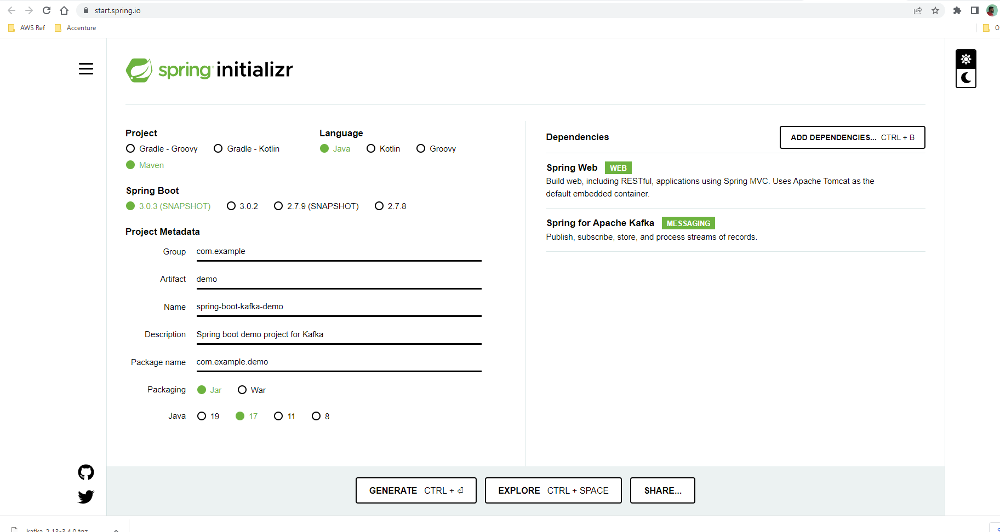

# spring-boot-kafka-demo
Using Spring boot to demonstrate a simple producer / consumer messaging usecase of Kafka. 

# Kafka setup

## Prerequisites
- `java 17`  (*Note: Kafka can run on `java 8+`, Since we plan to use `spring boot 3` `java 17` is required.*)

## Download
Download the latest Kafka release binary from the [official site](https://kafka.apache.org/downloads).

## Configure
[Official guide](https://kafka.apache.org/documentation/#quickstart) provides steps to quick start the Kafka environment in local.

### Windows
Users with windows OS can follow the below step along with the official guide. 

- Create `c:\kafka` directory.
- Copy the `kafka*.tgz` file to `c:\kafka` directory.
- Extract the file in the `c:\kafka` location. This can be achived in multiple ways. 
    - Using PowerShell `cd` into the kafka directory. 
    - `tar` command is available in PowerShell, using this the `*.tgz` file can be extracted. 
    - Run the command in PowerShell `tar -xvzf kafka_2.13-3.4.0.tgz` (Change the file name as per your download)
- After extracting the file, `cd` into the newly created `kafka_2.13-3.4.0` directory. 
- Two configuration files need to be changed. 
    - Change the `dataDir` value in `c:\kafka\kafka_2.13-3.4.0\config\zookeeper.properties` to `dataDir=c:/kafka/zookeeper-data`.
    - Change the `log.dirs` value in `c:\kafka\kafka_2.13-3.4.0\config\server.properties` to `log.dirs=c:/kafka/kafka-logs`

## Run
Follow the `Kafka with Zookeeper` section of the official guide. 

### Windows

Open windows command prompt. (Not PowerShell)
```
cd C:\kafka\kafka_2.13-3.4.0
```

```
.\bin\windows\zookeeper-server-start.bat .\config\zookeeper.properties
```

Keep this window running separately and open a new Command prompt.

```
cd C:\kafka\kafka_2.13-3.4.0
```
```
.\bin\windows\kafka-server-start.bat .\config\server.properties
```
Keep this window running separately. 

## Verify Installation
Your Kafka installation comes with utilities to test producer / consumer messaging. 

- Open windows command prompt
```
cd C:\kafka\kafka_2.13-3.4.0
```

### Create topic

```
.\bin\windows\kafka-topics.bat --create --topic quickstart-events --bootstrap-server localhost:9092
```

### Create message - Producer

```
.\bin\windows\kafka-console-producer.bat --topic quickstart-events --bootstrap-server localhost:9092
This is my first event
This is my second event
```

### Receive message - Consumer

```
.\bin\windows\kafka-console-consumer.bat --topic quickstart-events --from-beginning --bootstrap-server localhost:9092
This is my first event
This is my second event
```

# Create Spring boot project
- Visit spring boot initilizer site - https://start.spring.io



- As per above screenshot select the options and click generate to get the spring boot skeleton project.

- See the code in the repo for creating sample producer consumer messaging using Kafka.

